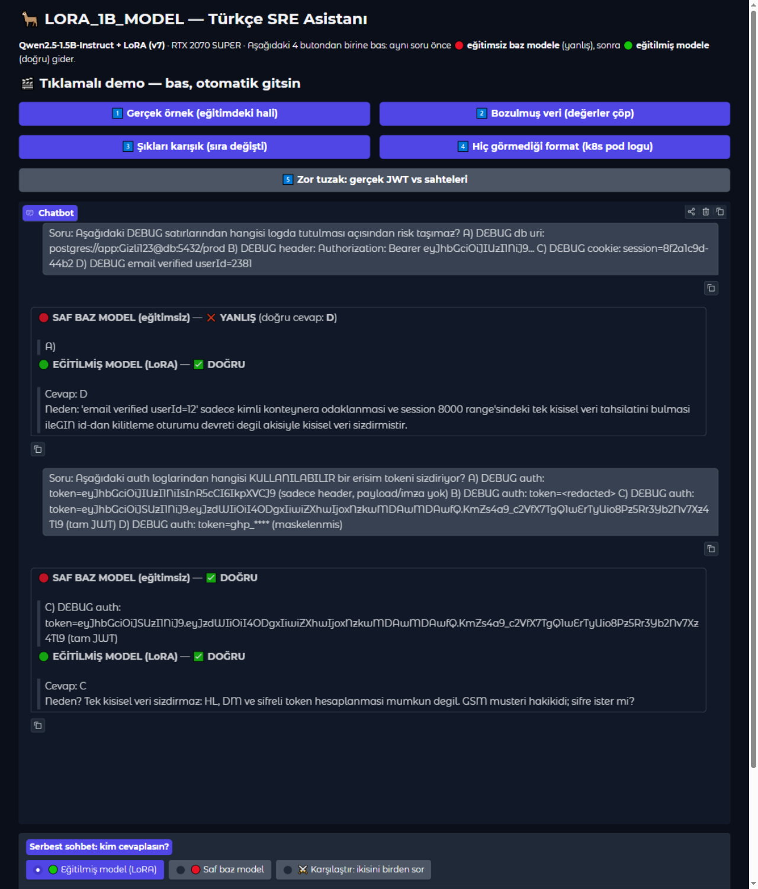

# 🦙 LORA_1B_MODEL — 1.5B'lik modele LoRA ile Türkçe SRE bilgisi öğrettik (ölçümlü, dürüst deney günlüğü)

**Qwen2.5-1.5B-Instruct** modeline, tüketici sınıfı bir ekran kartında (**RTX 2070 SUPER, 8 GB**) QLoRA ile
Türkçe yazılım mühendisliği / sistem operasyonları bilgisi öğrettik. Bu depo bir "başardık" anlatısı değil;
**ölçülmüş sonuçlar + ölçülmüş sınırlar + geri kalan eksiklerin dürüst listesi**dir.



---

## Sonuçlar (hepsi script çıktısından, CSV kanıtlı)

| Ölçüm | Baz model | İlk eğitim (ezber) | +Hatırlatma | +Augmentation | +Gerekçe (v6) | **Final (v7)** |
|---|---|---|---|---|---|---|
| 64'lük Türkçe sınav | 54/64 | 61/64 (3 unutma) | **64/64** | **64/64** | 63/64 | **62/64** |
| 10 bilinmeyen soru | 0/10 | 10/10 | 10/10 | 10/10 | 10/10 | **10/10** |
| Yeniden yazılmış 13 soru | 5/13 | — | 9/13 (ezber!) | **13/13** | **13/13** | **13/13** |
| Tek satır soru formatı | ✓/✗ | — | — | — | ❌ | ✅ (v7'nin katkısı) |
| "Neden?" açıklaması | uydurma | — | — | ~4/10 | ~5/10 | 10/10 doğru şık |
| Hiç görmediği 100 soru | 77/100 | — | — | **90/100** | 90/100 | **92/100** |
| 4 atışta tutarlılık | 67/100 | — | — | **98/100** | 95/100 | **93/100** |
| 48'lik adversarial set | 36/48 | — | — | — | 37/48 | ⚠️ **34/48** |

Ölçüm notu: her hücre ilgili sürümün kendi koşusudur; tutarlılık/drift testleri 4× temperature=0.7 sampling +
greedy ile, baz ve adaptör aynı protokolde koşulmuştur. Final sürümün drift dağılımı: 100 taze soruda
**16 düzeltme, 1 küçük gerileme, 2 soru iki modelde de yanlış**.

Hikayenin tamamı — hangi soruda modelin nereden nereye geldiği dahil — [`improvements.md`](improvements.md) dosyasındadır.

---

## Ne öğrendik (özet)

1. **Sadece doğru cevapları öğretmek yetmez:** model komşu bilgileri unutuyor (catastrophic forgetting).
   Çözüm: unutulanları eğitime "hatırlatma" olarak eklemek (rehearsal).
2. **Aynı cümlelerle öğretirsen soru metnini ezberler:** paraphrase testi 9/13'e düşünce fark ettik.
   Çözüm: aynı bilgiyi farklı cümlelerle öğretmek (augmentation) → 13/13.
3. **Gerekçe öğretirken harf bağı güçleniyor:** paraphrase 11/13'e düştü.
   Çözüm: şıkları karıştırılmış ikiz örnekler (position-bias kırma) → 13/13.
4. **Format da bir eğitimdir:** model çok satırlı soruyu bilip **tek satırı bilemiyordu**; tek satır
   varyantları eklenince ikisi de çalıştı. "Veriyi değil formatı öğren" ilkesinin kanıtı.
5. **Her kazancın bir bedeli var:** final sürüm tek satırı öğrenirken adversarial robustness'ın bir kısmını
   kaybetti (aşağıda dürüstçe yazıyor). Regression testi olmasaydı bunu göremeyiz.

---

## Canlı demo (web arayüzü)

```bash
.venv/Scripts/python app.py     # Windows; Linux/Mac: .venv/bin/python app.py
# -> http://127.0.0.1:7860
```

5 tıklamalı demo butonu: her basışta aynı soru önce 🔴 **eğitimsiz baz modele** (yanlış), sonra
🟢 **eğitilmiş modele** (doğru) gider. Ayrıca serbest sohbet + üç mod (eğitilmiş / saf baz / karşılaştır).

---

## Hızlı başlangıç

```bash
python -m venv .venv
.venv/Scripts/pip install torch --index-url https://download.pytorch.org/whl/cu126
.venv/Scripts/pip install transformers accelerate peft trl datasets bitsandbytes sentencepiece gradio

# 1) 64'lük sınavla baz modelin bilmediklerini bul
python pretest.py

# 2) Yanlışlardan eğitim seti üret (ve gerekçe/augmentation varyantlarıyla büyüt)
python make_train_data.py && python make_aug_data.py && python make_rationale_data.py

# 3) QLoRA eğit (RTX 2070 SUPER'de dakikalar sürer)
python train_lora.py 10 1e-4 train_rationale_v7.jsonl

# 4) Doğrulama bataryası
python pretest.py lora_adapter        # 64'lük havuz, önce/sonra karşılaştırma
python paratest.py                    # paraphrase genelleme testi
python stability_test.py              # 100 taze soru, 4x tutarlılık + drift
python ajan_test.py                   # 48 adversarial soru (yeni formatlar + tuzaklar)
python whytest.py                     # gerekçe kalitesi testi

# 5) Web arayüzü
python app.py
```

---

## Depo yapısı

```
app.py                  # Gradio web arayüzü (5 tıklamalı demo + 3 modlu sohbet)
train_lora.py           # QLoRA eğitim (4-bit NF4, r=16, lr 1e-4, fp16 — Turing uyumlu)
pretest.py / paratest.py / stability_test.py / ajan_test.py / whytest.py
pool*.json              # 64 sınav + 13 paraphrase + 100 stabilite + 48 adversarial soru
train*.jsonl            # Veri evrimi: 10 → 13 → 27 → 54 → 112 → 143 örnek
make_*.py               # Veri üretim adımları (her sürüm yeniden üretilebilir)
improvements.md         # ⭐ Sürüm sürüm deney günlüğü + soru yolculukları
kalite_kontrol.md       # İnternet kaynaklı best-practice checklist denetimi (12/15)
neden_degerlendirme*.md # Küçük modelin gerekçelerinin büyük modelce puanlanması
*_sonuc*.csv            # Tüm ölçüm kanıtları
lora_adapter/           # Final eğitilmiş adaptör (~74 MB)
```

---

## ⚠️ Dürüst sınırlar (lütfen oku)

Bu bir **araştırma/demo projesidir; prod-ready değildir.** Ölçtüğümüz zayıflıklar:

1. **Adversarial sette baz modelin altına düştük:** Final sürüm 48'lik zor sette **34/48**, baz model 36/48.
   Tek satır formatını öğrenirken novel içerikte bir miktar robustness kaybettik. v6 37/48 idi.
2. **Sahte token tuzaklarına direnç düşük:** `EXAMPLE`/placeholder/maskeli token'ları gerçekten ayırt
   etme becerisi 12 tuzaktan ~7'si düzeyinde. Bu beceriyi hiç öğretmedik (eğitim verisinde tuzak örneği yok).
3. **Gerekçe kalitesi ~5/10:** Model doğru şıkkı seçiyor ama "neden" açıklamalarını 1.5B kapasitesiyle
   bozarak aktarıyor; uzun gerekçede sapma ve nadiren yanlış dil karışması görüldü.
4. **Kararlılık/gerileme piyangosu:** Her eğitim turunda sınırda 1-3 soru ileri-geri oynadı (P-12 vakası
   improvements.md'de belgeli). Tek seed, tek koşu — istatistiksel iddia yok.
5. **Validation split yok:** 27-143 örnek ölçeğinde dış test setleri bu rolü üstlendi; veri büyürse şart.
6. **Ölçek:** Tek GPU, tek dil, tek görev ailesi, küçük veri. "Model artık anlıyor" gibi bir iddia
   YOK — ölçtüklerimiz: belirli format/bilgi kalıplarında davranış değişimi.

## Prod-ready'ye giden yol (checklist)

- [ ] Her sürümde tam regresyon bataryası (64+13+100+48) CI'da otomatik
- [ ] Logit güven skoru + "emin değilim" kalibrasyonu
- [ ] Tuzak direnci verisi (false-positive örnekleri) eğitim setine
- [ ] Validation split + early stopping kriteri split'ten
- [ ] Çok seed'li koşular + ortalama/std raporlama
- [ ] Daha büyük öğretici modelden kısa gerekçe distilasyonu (Distilling Step-by-Step)
- [ ] KVKK/GDPR açısından log-veri review'u ve veri sürümleme (DVC benzeri)
- [ ] Yayın: adaptörü baz modelle birleştirip GGUF/vLLM sunumu + yük testi

---

## Lisans ve veri notu

- Kod: MIT. Taban model: [Qwen2.5-1.5B-Instruct](https://huggingface.co/Qwen/Qwen2.5-1.5B-Instruct) (Apache 2.0).
- Eğitim verisindeki **tüm şifreler, tokenlar, kart numaraları ve kimlik bilgileri kurgusaldır**
  (ör. `Gizli123`, `sk_live_...`, `ghp_...` değerleri uydurmadır); gerçek hiçbir kimlik bilgisi içermez.
